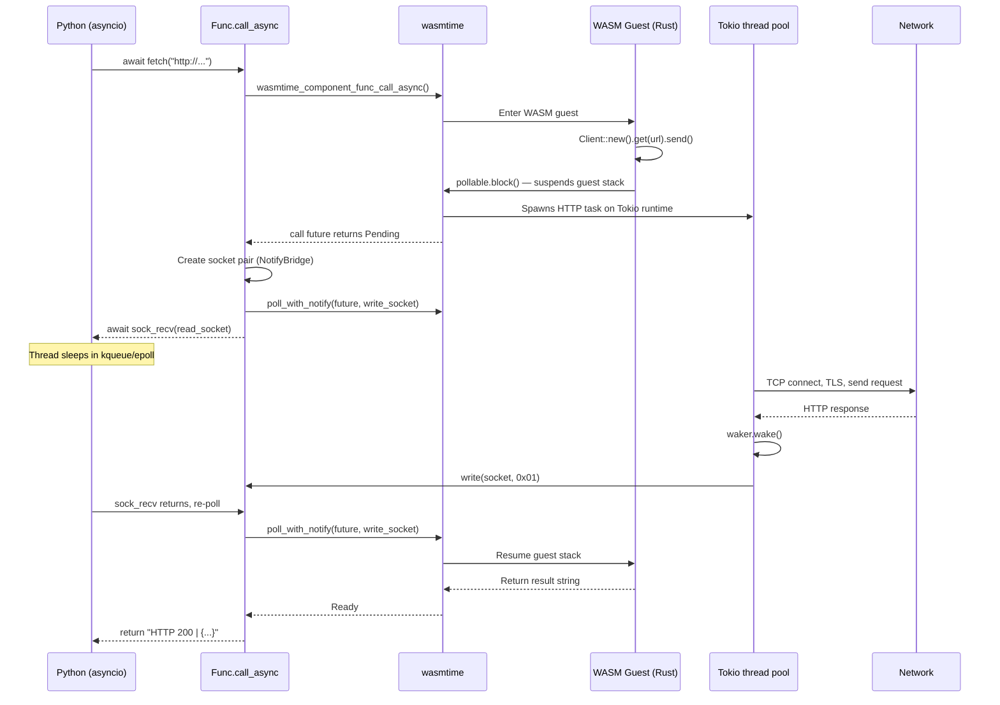
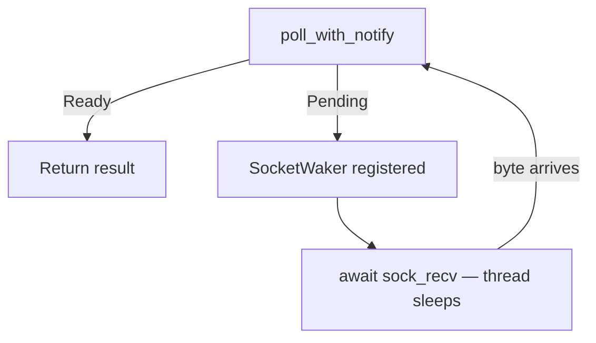

# Async Component Example

Demonstrates async WASM component calls using a socket-pair notification
bridge between Python's asyncio and wasmtime's background Tokio threads.

## Prerequisites

You need three things: a custom-built wasmtime library, a compiled WASM
component, and Python 3.11+.

### 1. Clone and build the wasmtime fork

This fork adds `wasmtime_call_future_poll_with_notify` to the C API:

```bash
git clone https://github.com/pgrayy/wasmtime.git
cd wasmtime
git checkout feat/background-thread-bridge
cargo build --release -p wasmtime-c-api
```

This produces `target/release/libwasmtime.dylib` (macOS) or
`target/release/libwasmtime.so` (Linux).

### 2. Link the library into wasmtime-py

wasmtime-py looks for the shared library at a platform-specific path
relative to its source tree:

```bash
# From the wasmtime-py repo root:
mkdir -p wasmtime/darwin-aarch64  # or linux-x86_64, etc.
ln -sf /absolute/path/to/wasmtime/target/release/libwasmtime.dylib \
    wasmtime/darwin-aarch64/_libwasmtime.dylib
```

### 3. Build the WASM component (Rust guest)

```bash
cd examples/async_component/pgrayy-component
cargo build --target wasm32-wasip2 --release
```

This requires the `wasm32-wasip2` target:
```bash
rustup target add wasm32-wasip2
```

## Running

```bash
cd examples/async_component
python demo.py
```

No virtualenv or pip dependencies required — only the standard library.

## Async Call Path

When Python calls `await client.fetch(url)`, the request travels through
five layers before a response comes back:



### Step by Step

#### 1. Python calls the async method

```python
result = await client.fetch("http://httpbin.org/ip")
```

This enters `Func.call_async()` in `wasmtime/component/_func.py`.

#### 2. Parameters cross the FFI boundary

The Python string is serialized into a `wasmtime_component_val_t` C struct
(the component model's wire format), then passed to wasmtime:

```python
future = ffi.wasmtime_component_func_call_async(
    byref(self._func), store._context(),
    param_capi, n, result_capi, result_len, byref(error_ptr))
```

**This is the handoff from Python to Rust.** wasmtime copies the string
into WASM linear memory and enters the guest's `fetch(url: String)` function.

#### 3. Guest executes and suspends

Inside the WASM sandbox, the guest runs:

```rust
Client::new().get(&url).send()
```

This calls `wasi:http/outgoing-handler`, which dispatches the HTTP request
to wasmtime's internal Tokio runtime — a process-wide multi-thread pool
(`crates/wasi/src/runtime.rs`). The guest then suspends at `pollable.block()`.

The call future returns `Pending`.

#### 4. Python sets up the notification bridge

```python
bridge = NotifyBridge()  # creates a socket pair
while not ffi.wasmtime_call_future_poll_with_notify(future, bridge.write_fd):
    await loop.sock_recv(bridge.read_sock, 64)
```

`poll_with_notify` registers a `SocketWaker` — when Tokio calls `wake()`,
it writes a byte to the socket. Python suspends on `sock_recv`, which puts
the OS thread to sleep in kqueue/epoll. No CPU is consumed.



#### 5. Tokio completes the HTTP request

On a background thread, Tokio runs the full HTTP flow:
TCP connect → TLS handshake → send request → receive response.

When done, it invokes `waker.wake()`, which writes one byte to the socket.
Python's event loop detects the byte and resumes the coroutine.

#### 6. Final poll and result

Python re-polls the future. wasmtime resumes the guest's suspended stack,
the guest returns the response string, and `poll_with_notify` returns `Ready`.
The result is converted back to a Python string.

### Key Design Decisions

- **No busy-polling** — sleeps on a real fd instead of `asyncio.sleep(0)` loops
- **No custom Tokio runtime** — reuses wasmtime-wasi's existing thread pool
- **No forked dependencies** — only one new C API function added to wasmtime
- **Per-call socket pair** — simple lifecycle, no shared state to manage

### Reading Order

Start from the Rust waker (the core mechanism), then follow the path up
through Python:

1. **`wasmtime/crates/c-api/src/async.rs`** — `SocketWaker` and
   `wasmtime_call_future_poll_with_notify`. This is the only new Rust code.
   ~40 lines. Understand this and everything else follows.

2. **`wasmtime/_notify_bridge.py`** — The socket pair that connects Rust to
   Python. Write end goes to `SocketWaker`, read end goes to asyncio.

3. **`wasmtime/component/_func.py`** — `call_async()` method. The poll loop
   that ties it all together: create future, fast-path poll, bridge setup,
   await notification, re-poll.

4. **`pgrayy-component/src/lib.rs`** — The WASM guest. Shows what Rust code
   looks like on the other side of the boundary (simple HTTP client using
   `wasi-http-client`).

5. **`client.py`** — Engine/store/linker setup. Shows the boilerplate needed
   to load a WASM component and call it from Python.

6. **`demo.py`** — User-facing code. Shows what the developer actually writes.

Supporting changes (plumbing, not core logic):

- **`wasmtime/_bindings.py`** — ctypes declarations for `poll_with_notify`,
  `component_func_call_async`, and async linker functions.
- **`wasmtime/_config.py`** — `async_stack_size` and `wasm_component_model_async` properties.
- **`wasmtime/_store.py`** — `set_wasi_http()` method.
- **`wasmtime/component/_linker.py`** — `add_wasip2_async()`, `add_wasi_http_async()`, `instantiate_async()` methods.

### Commits

- **wasmtime** ([`pgrayy/wasmtime@feat/background-thread-bridge`](https://github.com/pgrayy/wasmtime/tree/feat/background-thread-bridge)):
  One commit adding `SocketWaker` + `poll_with_notify` to the C API.

- **wasmtime-py** ([`pgrayy/wasmtime-py@feat/background-thread-bridge`](https://github.com/pgrayy/wasmtime-py/tree/feat/background-thread-bridge)):
  One commit adding `call_async`, the notify bridge, supporting config/store/linker
  methods, the exnref fix, and this example.
